# What-the-FiT

## Overview
Activity tracker and Heart rate monitor app that uses the phones internal sensor accelerometer and heart rate sensor.


## App features
* Set workout goal for a week/month.
* Track progress of the goal.
* Track each workout(google map api).
* Calculate the distance travelled during a workout.
* Calculate calories burned during a workout.
* Show list of workouts history.
* Measure heart rate and show data in a graph.


## Build 
Clone this repository and import into **Android Studio**
```bash
git clone gitlab.com/khan.alishup/what-the-fit.git
```
## API Reference
* Minimum SDK: 20
* Target SDK: 29

## Screenshot 
<div align="center">
   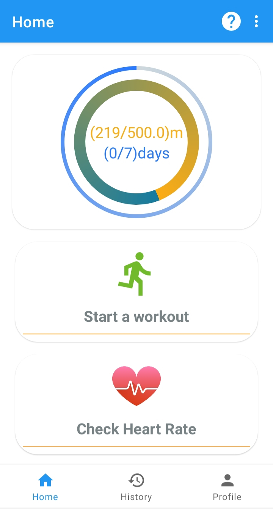
   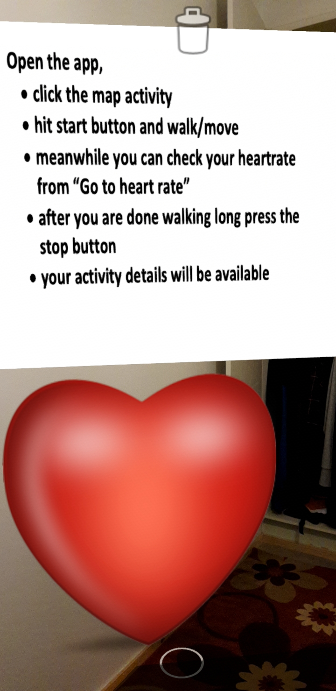
   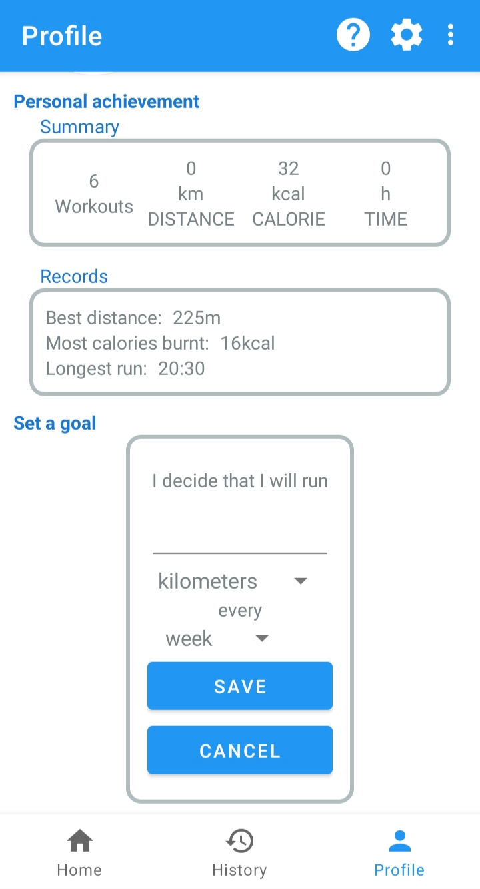
   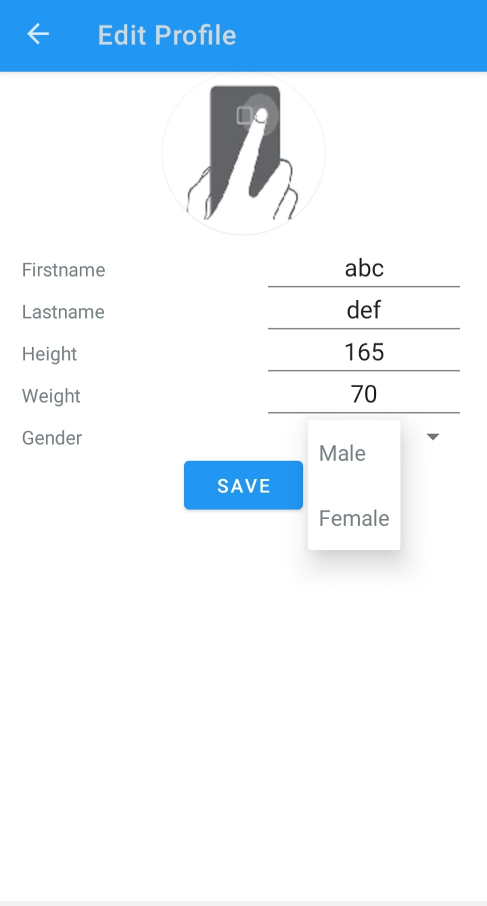
   
   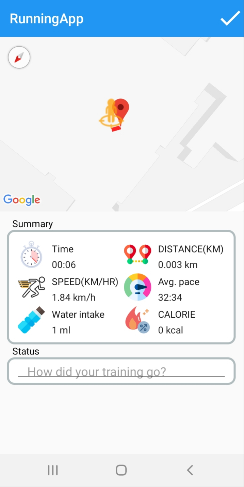
   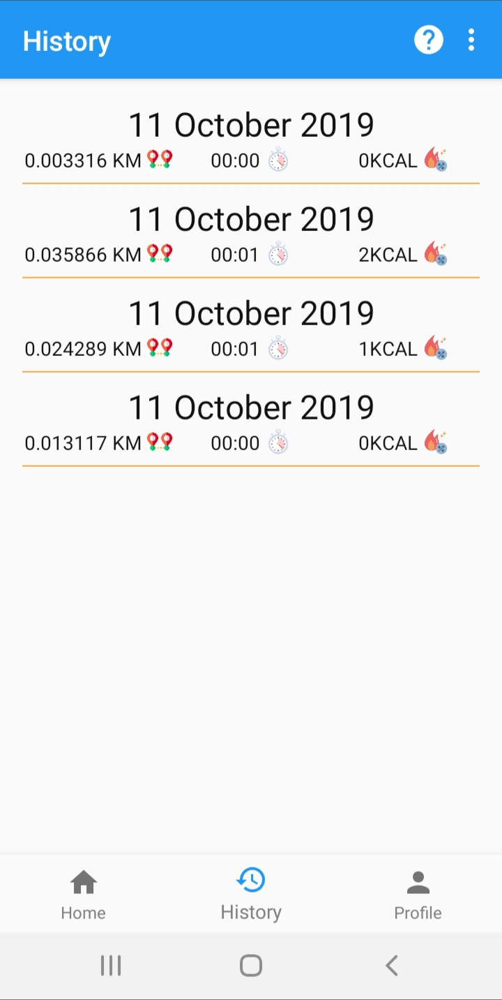
   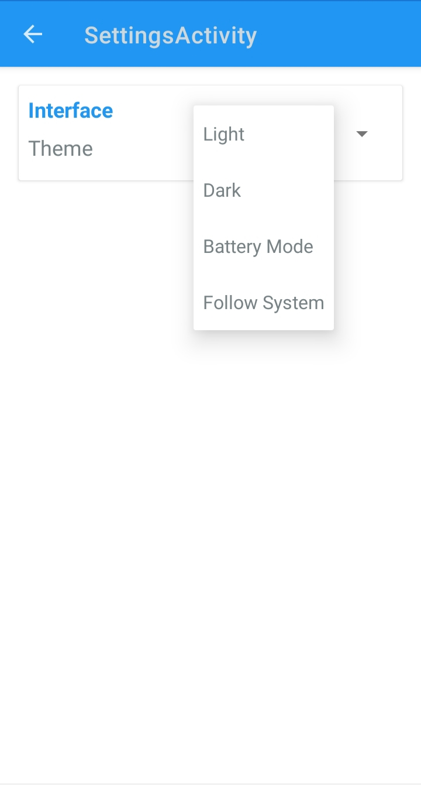
   
   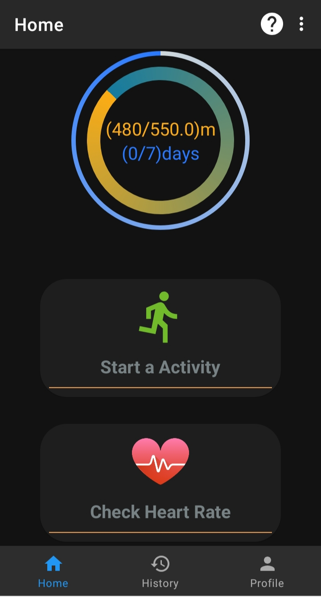
   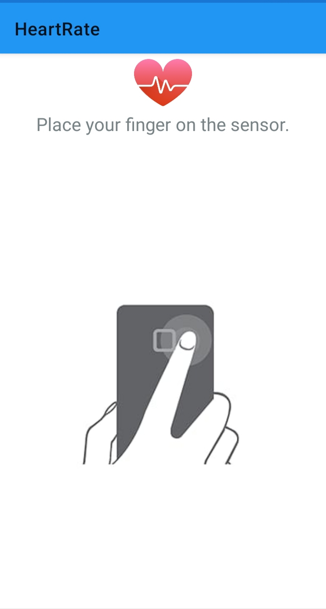
   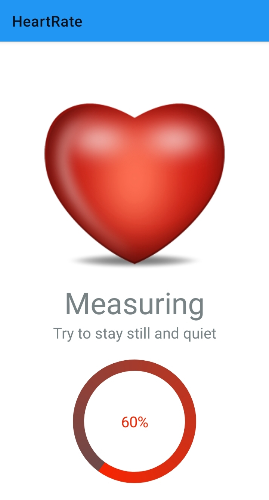
   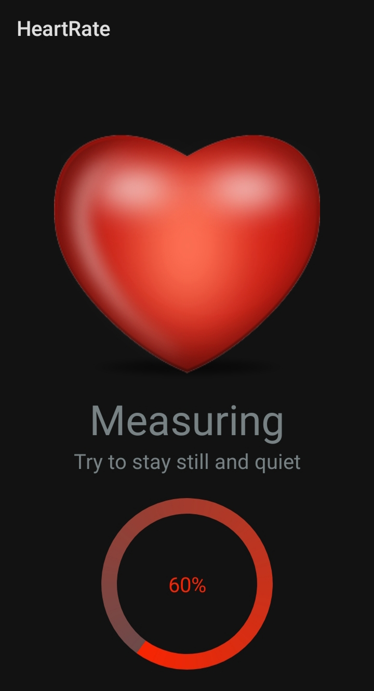
   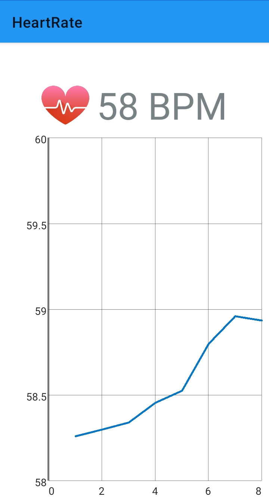
  </div>

## License


## Contributors
### Github users
* [ishupk](https://gitlab.com/khan.alishup)
* [utsabk](https://gitlab.com/utsabk)